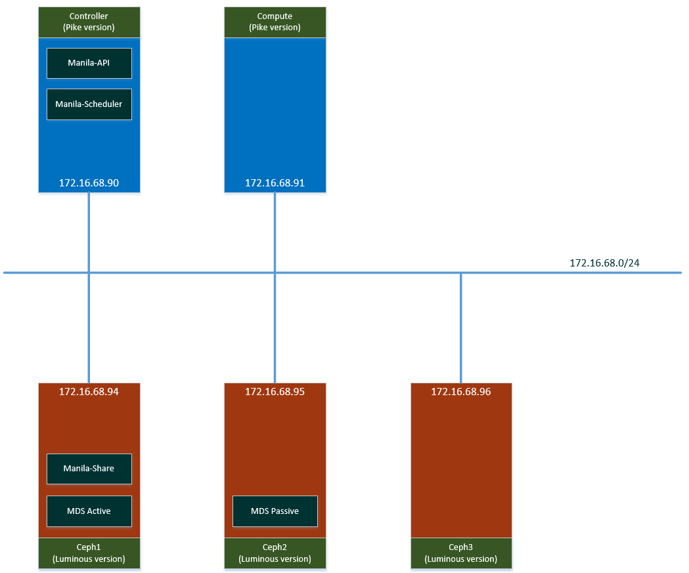

# I. Mô hình cài đặt


# II. Thực hiện cài đặt

## 1. Thực hiện trên node Controller

### 1.1. Thực hiện khởi tạo database, làm các bước sau

- Kết nối database với user root
<font color="green">
```
$ mysql -u root -p
```
</font>
- Khởi tạo database *manila*:
```
CREATE DATABASE manila;
```
- Gán quyền truy cập manila database:
```
GRANT ALL PRIVILEGES ON manila.* TO 'manila'@'localhost' \
  IDENTIFIED BY 'MANILA_DBPASS';
GRANT ALL PRIVILEGES ON manila.* TO 'manila'@'%' \
  IDENTIFIED BY 'MANILA_DBPASS';
```
Thay MANILA_DBPASS bằng mật khẩu phù hợp
- Thoát khỏi database client

### 1.2. Export các thông tin xác thực 
```
$ source admin-openrc.sh
```

### 1.3. Khởi tạo service
- Khởi tạo **manila**  user:
```
$ openstack user create --domain default --password-prompt manila
User Password:
Repeat User Password:
+-----------+----------------------------------+
| Field     | Value                            |
+-----------+----------------------------------+
| domain_id | e0353a670a9e496da891347c589539e9 |
| enabled   | True                             |
| id        | 83a3990fc2144100ba0e2e23886d8acc |
| name      | manila                           |
+-----------+----------------------------------+
```
- Thêm **admin** role cho **manila** user
```
$ openstack role add --project service --user manila admin
```
- Khởi tạo **manila** và **manilav2** service 
```
$ openstack service create --name manila \
  --description "OpenStack Shared File Systems" share
  +-------------+----------------------------------+
  | Field       | Value                            |
  +-------------+----------------------------------+
  | description | OpenStack Shared File Systems    |
  | enabled     | True                             |
  | id          | 82378b5a16b340aa9cc790cdd46a03ba |
  | name        | manila                           |
  | type        | share                            |
  +-------------+----------------------------------+
```

```
$ openstack service create --name manilav2 \
  --description "OpenStack Shared File Systems" sharev2
  +-------------+----------------------------------+
  | Field       | Value                            |
  +-------------+----------------------------------+
  | description | OpenStack Shared File Systems    |
  | enabled     | True                             |
  | id          | 30d92a97a81a4e5d8fd97a32bafd7b88 |
  | name        | manilav2                         |
  | type        | sharev2                          |
  +-------------+----------------------------------+
  
```
  
  

